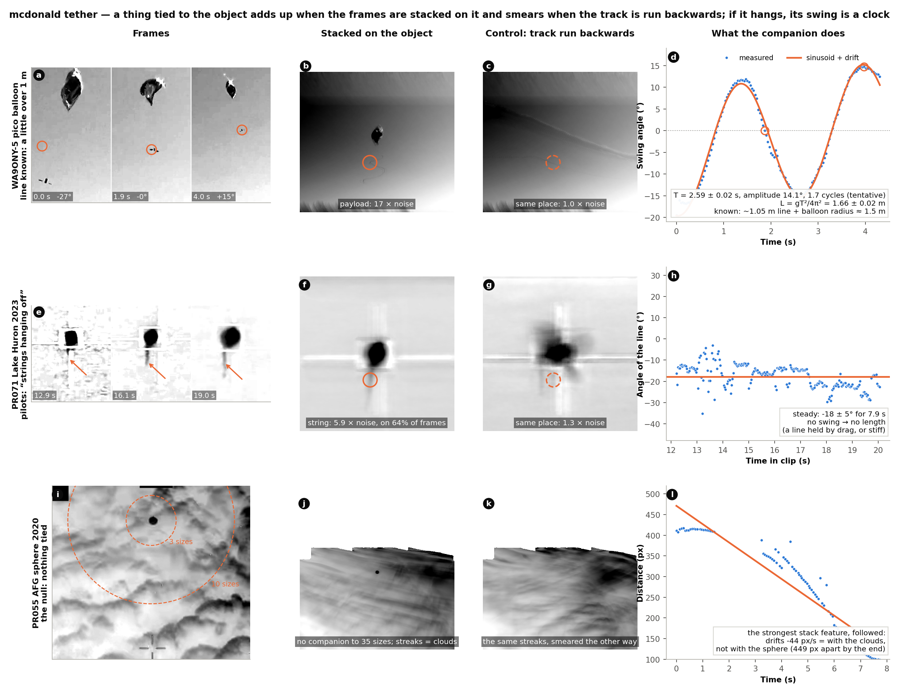

# `mcdonald tether`: does it work?

Three clips, four views each (`tether-validation.png`). Rows: a pico balloon whose line
is known; the Lake Huron object whose pilots reported "strings hanging off"; a sphere
among clouds where nothing is tied. Columns: frames; the frames stacked on the object;
the control (the same frames stacked on the track run backwards); what the companion
does over time.



## WA9ONY-5 — the calibration

A ham-radio pico balloon launched 2021-07-13 (YouTube `tl8_etApsro`, Sony camera,
1080p30), a 13 g WB8ELK Skytracker payload under a mylar balloon. The builder's own
assembly video (`fU5cbNv_oiQ`, at 3:22) gives the ground truth: *"a swivel, and then
about a little over one meter of cable, which is attached to the bottom of the balloon."*

Free flight 84–92 s; the balloon tracked 85.8–90.0 s (after that the tracker jumps onto
the payload, and the track is cut there — `tests/golden/wa9ony5_balloon_track.csv`).

- (b) stacked on the balloon, the payload is a dark dot 3.2 object sizes out, 14° left of
  straight down, **17 × the stack's noise**; (c) at the same place on the reversed track,
  **1.0 ×**.
- (d) followed on 130 frames: the swing angle is a clean sinusoid. **T = 2.59 ± 0.02 s,
  amplitude 14.1°, 1.7 cycles (tentative), L = gT²/4π² = 1.66 ± 0.02 m.**
- Known: ~1.05 m of line. The pivot of a balloon's pendulum is the balloon's centre, not
  its neck — a balloon's inertia is mostly the air it displaces — so the pendulum is the
  line plus the balloon's radius (~0.3–0.4 m for an under-filled 36-inch pico balloon) plus
  the payload's own offset below the swivel: ≈ 1.5 m. The balloon's bounding size at that
  scale is ~0.7 m (the payload sits 2.2 sizes below), right for such a balloon.
- The error is statistical (a block bootstrap of the fit's residuals). The 1.7 cycles are
  why the tool calls it tentative; the periodogram on this window peaks at 2.8 s, which is
  the window's cap, not a period — the reason the sinusoid is the estimator.

A second camera on the same launch (iPad, `ap2nxbCL3T8`, 608×1080) is too shaky for an
independent number: 2.5–3.5 s, noisy.

## PR071 — a line, held steady

The Lake Huron object (2023-02-12), frames 367–603 (12.2–20.1 s), the object held in the
pod's tracking gate.

- (e) a thin dark line hangs from the object's underside in every frame.
- (f) stacked on the object it stays sharp — **1.6 sizes below, 14° left, 5.9 × noise, on
  64 % of single frames, jitter 3 px** — while the gate's box doubles (the tracker lags);
  (g) on the reversed track it is gone (1.3 ×).
- (h) followed for 7.9 s its angle holds at **−18 ± 5°**: no swing, so no length. A line
  held by drag, or stiff.

Before the overlay's strokes were masked, two bright gate-box edges passed every test:
they *are* tied to the object, by the tracker. With the strokes masked and a reticle arm's
remnant rejected on its jitter (the tracker's lag), the string is what is left.

## PR055 — the null

The sphere among clouds (AFG, 2020), the original frames 1068–1300, the sphere 24 px.

- (i) nothing inside 10 sizes of the sphere; no parachute streamer at 1–2 sizes.
- (j, k) the stacks are cloud streaks either way. The strongest features (7–22 sizes
  out) pass the reversed-track control and even the single-frame test, because cloud
  texture is dark *somewhere* in any patch on most frames (their jitter, 11–14 px, says
  so).
- (l) followed, the strongest drifts away at 44 px/s — with the clouds, not the sphere,
  449 px apart by the end. **Nothing tied.**

## Reproduce

```bash
export MCDONALD_CATALOG=.../pursue_index/records.csv       # PR071, PR055
export MCDONALD_FOOTAGE=/a/folder/holding/tl8_etApsro.mp4   # yt-dlp, see tests/test_golden.py
python3 tests/test_golden.py                                # ~10 minutes with the videos
python3 tests/test_tether.py                                # the portable checks, seconds
```

Each run of `mcdonald tether` writes its own three-panel figure (`<tag>_tether.png`);
the composite above was drawn from the three cases' outputs.
